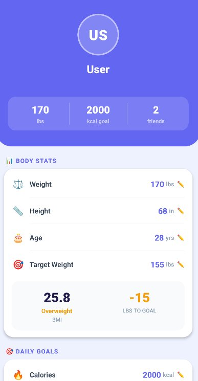
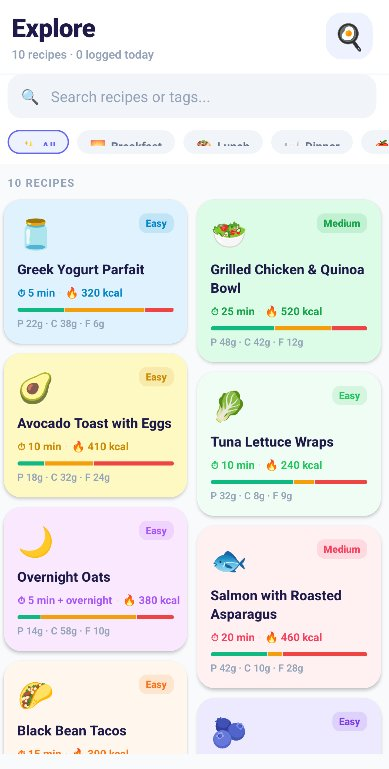
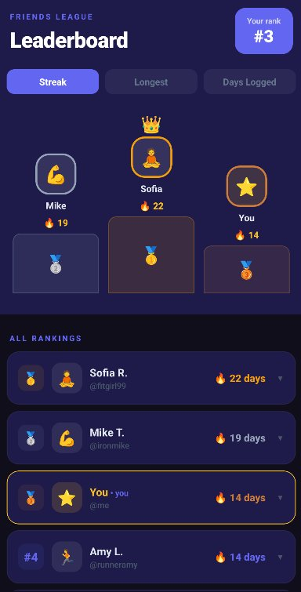

# 🍽️ MyMealTracker

A full-stack mobile application for tracking daily meals, exploring recipes, and competing with friends on nutrition streaks. Built with a **React Native** frontend (iOS & Android) and a **Java Spring Boot** REST API backend.

> CS 1530 Project — University of Pittsburgh

---

## 📸 Screenshots

<p align="center">
  
  &nbsp;&nbsp;
  
  &nbsp;&nbsp;
  
</p>

---

## ✨ Features

- **Profile & Body Stats** — Track weight, height, age, and target weight. Displays BMI and pounds-to-goal automatically.
- **Daily Calorie Goals** — Set a personal kcal goal and monitor your daily intake.
- **Explore Recipes** — Browse recipes filtered by meal type (Breakfast, Lunch, Dinner, etc.) with prep time, calories, and macro breakdowns (protein, carbs, fat).
- **Recipe Search** — Search by name or tag to find meals that fit your goals.
- **Meal Logging** — Log meals directly from the Explore screen to track daily intake.
- **Friends League & Leaderboard** — Compete with friends on logging streaks. Rankings show streak length, longest streak, and total days logged.

---

## 📁 Project Structure

```
mymealtracker/
├── api/                  # Spring Boot backend (Java)
└── frontend/
    └── my-app/           # React Native mobile app
```

---

## 🚀 Getting Started

### Prerequisites

- **Backend:** Java 17+, Gradle
- **Frontend:** Node.js, npm, Android Studio (for Android) or Xcode (for iOS)

---

## 🖥️ Backend Setup (Spring Boot)

```bash
cd ./api
```

**Configure environment variables:**

On Windows (PowerShell):

```powershell
Get-Content .env | ForEach-Object {
  $var = $_ -split '=', 2
  [System.Environment]::SetEnvironmentVariable($var[0], $var[1])
}
```

On macOS/Linux:

```bash
export $(cat .env | xargs)
```

**Build and run:**

```bash
# Build
./gradlew clean build

# Run
./gradlew bootRun
```

**Verify the server is running:**

Navigate to [http://localhost:8080/ping](http://localhost:8080/ping) — you should get a success response.

---

## 📱 Frontend Setup (React Native)

```bash
cd ./frontend/my-app
```

**Install dependencies:**

```bash
npm install
```

**Start the emulator:**

- For Android: Open Android Studio and start an Android Virtual Device (AVD)
- For iOS: Open Xcode and start a simulator

> ⚠️ Wait for the emulator/simulator to fully boot before running the app.

**Run the app:**

```bash
# Android
npm run android

# iOS
npm run ios
```

---

## 🛠️ Tech Stack

| Layer      | Technology                |
| ---------- | ------------------------- |
| Frontend   | React Native (JavaScript) |
| Backend    | Java, Spring Boot         |
| Build Tool | Gradle                    |
| Platforms  | Android, iOS              |

---

## 📄 License

This project is licensed under the [MIT License](LICENSE).
